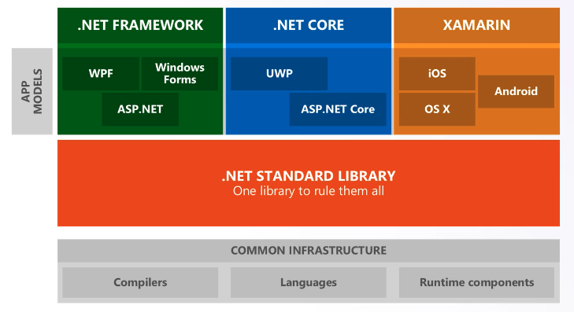

# Frameworks

## .NET Framework

C# é a linguagem, .NET é o frameworks. .NET teve a primeira versão em 2001. 

Pode ser instalado side-by-side, ou seja, podemos ter mais de uma versão do framework na mesma máquina. É compatível somente com Windows e hoje já está quase sendo considerado legado e sendo substituído pelo .NET Core.

## .NET Core

É a versão mais moderna do .NET Framework, lançado em meados de 2015. Diferente do .NET Framework, é compatível com outros sistmas operacionais. No início, tinha somente o essencial (daí o nome Core). Ao longo do tempo, o .NET Framework foi totalmente reescrito.

Também tem a instalação side-by-side. 

## .NET Standard

.NET Framework e .NET Core coexistem, podem ser instalados e utilizados juntos. Para garantir que algo rode em ambos, é preciso de um padrão, o .NET Standard. Não é um framework, funciona como um contrato chamado de Surface API.

## .NET 5

Unificação do .NET Framework e .NET Core. O .NET Core já tem o nível de conteúdo do .NET Framework e não faz mais sentido ter os dois frameworks separados.

## Releases

- .NET Core: releases semestrais 
- .NET 5 e futuros: lançamentos anuais

LTS: long term support:
- .NET Framework: todos 
- .NET Core: versões com final 1
- .NET 5 e futuros: versões maiores
